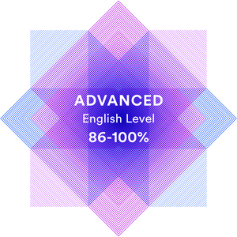

# Ivan Zolkin

> Junior Web Developer

## Contact information

- **Location:** Moscow, Russia
- **GitHub:** [@ivanzolkin](https://github.com/ivanzolkin)
- **Telegram:** [@ivanzolkin1](https://t.me/ivanzolkin1)
- **Discord-server:** [Ivan Zolkin (@ivanzolkin)](https://discord.gg/PRADsJB)

## About me

Hi there! My name is Ivan Zolkin and I am currently residing in Moscow. I am excited to introduce myself as an aspiring Fullstack Software Engineer who has just begun my journey towards this career path. Currently, I am learning the necessary skills and knowledge at [RS School](https://rs.school/) to achieve my goal.

As a beginner, I believe that my strong work ethic and attention to detail are some of my greatest strengths. I am a quick learner and eager to take on new challenges to broaden my horizons. I am passionate about the world of web development and always strive to learn and discover new things in this field.

I am excited to take on new opportunities and grow as a Fullstack Web Developer. I look forward to working with others in the industry to develop high-quality websites and applications that make a difference in people's lives.

## Projects

| Название | Описание                                                            | Ссылка                                                                             | 
| -------- | ------------------------------------------------------------------- | ---------------------------------------------------------------------------------- |
| CV Task  | Первое практическое задание курса "JS / FRONT-END 2023Q1 Stage #1"  | [ivanzolkin.github.io/rsschool-cv/cv](https://ivanzolkin.github.io/rsschool-cv/cv) |

## Skills

-   HTML5, CSS3
-   JavaScript Basics
-   Git, GitHub
-   VS Code
-   Adobe Photoshop, Figma

## Code example:
> Make a simple function called `greet` that returns the most-famous "hello world!".

```javascript
const greet = () => 'hello world!';
```

## Languages
- Russian – Native­
- English – C1 Advanced (according to the [EF SET Quick Check](https://www.efset.org/quick-check/))<br>
